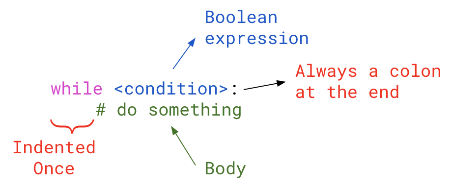

# 5.6 While Loops

Today, we will take a look at another type of loop: `while` loops.
Remember that a `for` loop is an example of a **COUNTED LOOP**. A counted loop is a type of loop that loops based on a specific number of times. 

A `while` loop is an example of a <ins>**CONDITIONAL LOOP**</ins> where it loops as long as a *conidition remains true*. It repeatedly checks a condition and executes code until the condition is false.

| `for` loop | `while` loop |
| ---------- | ------------ |
| Used when a program needs to repeat a **specific number of times** | Used when a program needs to loop **until a particular condition occurs** |

<span style="color:red">
NOTE: A while loop can be used anywhere a for loop is used
</span>

## General Structure


## Example #1: For Loop to While Loop - Incrementing
One of the examples in our for loop lesson was looking at a for loop that prints the numbers between 1 and 5. Here was the code for that loop:
```python
for i in range(1, 6):
  print(i)
```

Here is the `while` loop version:
```python
i = 1
while i < 6:
  print(i)
  i += 1
```

## Overall Steps of a  `while` Loop
1. The condition is evaluated
2. If the condition is `True`, go to Step 3. 
If the condition is `False`, the loop ends and continues code after the loop.
3. Execute the body of the loop
4. Go to Step 1.

## Example #2: Decrementing
In the previous example, we printed the numbesr from 1 to 5. What if we wanted to print from 5 to 1?
```python
i = 5
while i > 0:
  print(i)
  i -= 1
```

# Input in a Loop
A useful application of `while` loops is user input in a loop. This can be useful in the following examples:
- Checking a guess in a guessing game
- Checking a password
- Check if the user inputted a number out of range (e.g. marks must be between 0 and 100)

## Example #3: Calculating the Average
We've done an example previously in Lesson 5.5 with user input in a loop. We created a program that calculates the average for a class. In this problem, we used a `for` loop. Here is what that looked like:
```python
num_of_students = int(input("Enter the number of students: "))

sum = 0

# Ask user for marks and sum all marks
for i in range(num_of_students):
  mark = float(input(f"Enter mark {i+1}: "))
  sum += mark

average = sum/num_of_students

print(f"Your class average is {average}")
```

### Change this to a while loop:
```python
num_of_students = int(input("Enter the number of students: "))

sum = 0

# Delete this comment and place your while loop here

average = sum/num_of_students

print(f"Your class average is {average}")
```

## Example #4: Guessing Game
We wrote a guessing game before using if statements but we only allowed the user to guess once. What if we wanted to have the user keep guessing until they get it right?

Because we don't know how many guesses it will take them, a `while` loop would be more useful in this case.

Here is an incorrect attempt at the solution for this problem:
```python
my_num = 34

guess = int(input("Enter guess: "))

while guess != my_num:
  print("Sorry, wrong number")
```
What's happening when we run this program?
>
Why?
>

<span style="color: red">
<b>NOTE:</b> It is important to make sure the condition has a chance to change/update during the while loop. If it doesn't, it could result in an <b>infinite loop</b>
</span>
<br><br>

# 
### Part (a): Write a program that generates a random number between 1 and 100.
### Part (b): A user will keep guessing until they get it correct.
### Part (c): To help the user, let them know after each guess if they guessed too high or too low.

Correct attempt:
```
Pseudocode:

```
```python

```
